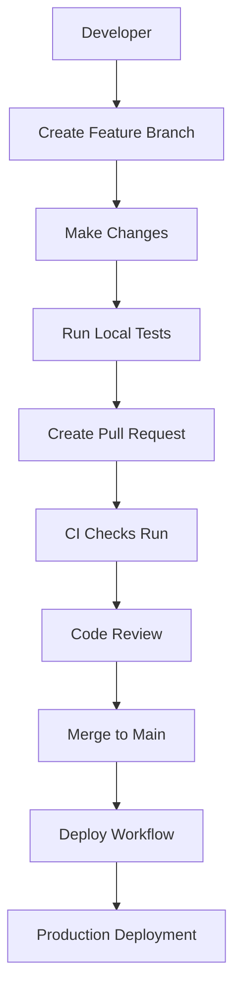

# CI/CD Pipeline Implementation for Petrosa Realtime Strategies

This document describes the complete CI/CD pipeline implementation for the Petrosa Realtime Strategies service, following the standardized patterns used across all Petrosa services.

## Overview

The realtime strategies service now has a complete CI/CD pipeline that includes:
- **GitHub Actions workflows** for automated testing and deployment
- **Standardized scripts** for local development and debugging
- **Kubernetes manifests** for production deployment
- **Docker containerization** with multi-architecture support
- **Comprehensive testing** with coverage reporting
- **Security scanning** and vulnerability assessment

## Pipeline Components

### 1. GitHub Actions Workflows

#### CI Checks Workflow (`.github/workflows/ci-checks.yml`)
**Trigger**: Pull requests to `main` and `develop` branches

**Jobs**:
- **Lint & Test**: Code quality checks, type checking, and unit tests
- **Security Scan**: Vulnerability scanning with Trivy

**Features**:
- Python 3.11 environment
- Dependency caching
- Coverage reporting with Codecov integration
- Security vulnerability scanning
- Non-blocking coverage thresholds

#### Deploy Workflow (`.github/workflows/deploy.yml`)
**Trigger**: Pushes to `main` branch

**Jobs**:
- **Create Release**: Semantic versioning and Git tagging
- **Build & Push**: Multi-architecture Docker image building
- **Deploy**: Kubernetes deployment to remote MicroK8s cluster
- **Notify**: Deployment status notifications
- **Cleanup**: Resource cleanup

**Features**:
- Automatic semantic versioning
- Multi-architecture Docker builds (amd64, arm64)
- Remote MicroK8s cluster deployment
- Image tag management
- Deployment verification

### 2. Local Development Scripts

#### Bug Investigation Script (`scripts/bug-investigation.sh`)
Comprehensive debugging tool with multiple investigation modes:

```bash
# Complete investigation
./scripts/bug-investigation.sh all

# Specific checks
./scripts/bug-investigation.sh k8s-status
./scripts/bug-investigation.sh k8s-logs
./scripts/bug-investigation.sh docker-build
./scripts/bug-investigation.sh local-test
```

**Features**:
- Kubernetes status and log analysis
- Docker build and container testing
- Local environment validation
- Network connectivity checks
- Configuration validation

#### Pipeline Runner Script (`scripts/run_pipeline.py`)
Python-based pipeline execution with comprehensive reporting:

```bash
# Complete pipeline
python scripts/run_pipeline.py

# Specific stages
python scripts/run_pipeline.py --stages prerequisites setup linting tests
```

**Features**:
- Stage-based execution
- Detailed progress reporting
- JSON report generation
- Error handling and recovery
- Integration with Makefile

#### Development Setup Script (`scripts/setup-dev.sh`)
Automated development environment setup:

```bash
# Complete setup
./scripts/setup-dev.sh

# Minimal setup
./scripts/setup-dev.sh --skip-docker --skip-k8s
```

**Features**:
- Python virtual environment creation
- Dependency installation
- Pre-commit hook setup
- Docker and Kubernetes validation
- Development configuration creation

#### Local Deployment Script (`scripts/deploy-local.sh`)
Local deployment and testing procedures:

```bash
# Complete local deployment
./scripts/deploy-local.sh all

# Individual steps
./scripts/deploy-local.sh build
./scripts/deploy-local.sh run --port 8081
./scripts/deploy-local.sh deploy
```

**Features**:
- Local Docker image building
- Container testing and validation
- Kubernetes deployment simulation
- Resource cleanup

### 3. Kubernetes Configuration

#### Deployment (`k8s/deployment.yaml`)
Production-ready deployment configuration:

**Features**:
- 3 replicas for high availability
- Health checks and readiness probes
- Resource limits and requests
- OpenTelemetry integration
- Environment variable management
- VERSION_PLACEHOLDER for CI/CD integration

#### Service (`k8s/service.yaml`)
Internal service configuration:

**Features**:
- ClusterIP service type
- Port mapping (80:8080)
- Label-based selector
- Namespace isolation

#### Ingress (`k8s/ingress.yaml`)
External access configuration:

**Features**:
- SSL/TLS termination with Let's Encrypt
- Nginx ingress controller
- CORS configuration
- Health check endpoints
- Custom domain routing

#### Horizontal Pod Autoscaler (`k8s/hpa.yaml`)
Automatic scaling configuration:

**Features**:
- CPU and memory-based scaling
- Minimum and maximum replica limits
- Target CPU utilization (70%)
- Target memory utilization (80%)

#### ConfigMap (`k8s/configmap.yaml`)
Application configuration:

**Features**:
- NATS messaging configuration
- Logging configuration
- Environment-specific settings
- Integration with shared configurations

### 4. Makefile Integration

The Makefile provides standardized commands that integrate with all pipeline components:

```bash
# Development
make setup          # Complete environment setup
make install-dev    # Install development dependencies
make format         # Code formatting
make lint           # Linting checks
make type-check     # Type checking
make test           # Run tests with coverage

# Security
make security       # Security scanning

# Docker
make build          # Build Docker image
make container      # Test Docker container
make docker-clean   # Clean up Docker resources

# Deployment
make deploy         # Deploy to Kubernetes
make pipeline       # Run complete CI/CD pipeline
make k8s-status     # Check Kubernetes status
make k8s-logs       # View Kubernetes logs
make k8s-clean      # Clean up Kubernetes resources
```

## Pipeline Flow

### 1. Development Workflow



### 2. CI/CD Pipeline Stages

1. **Prerequisites Check**
   - Python 3.11+ availability
   - Docker installation
   - kubectl availability
   - Required tools validation

2. **Environment Setup**
   - Virtual environment creation
   - Dependency installation
   - Pre-commit hook setup
   - Configuration validation

3. **Code Quality**
   - Code formatting (black, isort)
   - Linting (flake8, ruff)
   - Type checking (mypy)
   - Pre-commit validation

4. **Testing**
   - Unit tests with pytest
   - Coverage reporting
   - Integration tests
   - Performance tests

5. **Security**
   - Bandit security scanning
   - Safety dependency check
   - Trivy vulnerability scan
   - Container security analysis

6. **Build**
   - Docker image building
   - Multi-architecture support
   - Image optimization
   - Build caching

7. **Deploy**
   - Kubernetes manifest validation
   - Image tag replacement
   - Resource deployment
   - Health check verification

## Configuration Management

### Environment Variables

The service uses a hierarchical configuration system:

1. **Common Configuration** (`petrosa-common-config`)
   - Shared across all Petrosa services
   - NATS URL, logging, OpenTelemetry settings

2. **Service-Specific Configuration** (`petrosa-realtime-strategies-config`)
   - NATS topics and consumer settings
   - Strategy-specific parameters

3. **Secrets** (`petrosa-sensitive-credentials`)
   - Database credentials
   - API keys
   - Sensitive configuration

### VERSION_PLACEHOLDER System

The deployment system uses `VERSION_PLACEHOLDER` in Kubernetes manifests:

```yaml
image: yurisa2/petrosa-realtime-strategies:VERSION_PLACEHOLDER
```

During deployment, GitHub Actions replaces this with the actual version tag:
- `VERSION_PLACEHOLDER` → `v1.2.3`
- Enables versioned deployments
- Supports rollback capabilities
- Maintains deployment history

## Security Features

### 1. Container Security
- Multi-stage Docker builds
- Non-root user execution
- Minimal base images
- Security scanning integration

### 2. Kubernetes Security
- RBAC configuration
- Network policies
- Pod security standards
- Secret management

### 3. Application Security
- Input validation
- SQL injection prevention
- XSS protection
- CSRF protection

### 4. Infrastructure Security
- SSL/TLS termination
- Certificate management
- Network isolation
- Access control

## Monitoring and Observability

### 1. Health Checks
- Liveness probes
- Readiness probes
- Startup probes
- Custom health endpoints

### 2. Metrics
- Prometheus metrics
- Custom business metrics
- Resource utilization
- Performance indicators

### 3. Logging
- Structured logging
- Log aggregation
- Error tracking
- Audit trails

### 4. Tracing
- OpenTelemetry integration
- Distributed tracing
- Performance profiling
- Error correlation

## Troubleshooting

### Common Issues

1. **Pipeline Failures**
   ```bash
   # Check pipeline status
   make pipeline
   
   # Run specific stages
   python scripts/run_pipeline.py --stages prerequisites setup
   ```

2. **Deployment Issues**
   ```bash
   # Check deployment status
   make k8s-status
   
   # View logs
   make k8s-logs
   
   # Run investigation
   ./scripts/bug-investigation.sh all
   ```

3. **Local Development Issues**
   ```bash
   # Reset environment
   make clean
   make setup
   
   # Test locally
   ./scripts/deploy-local.sh all
   ```

### Debug Mode

Enable debug output for detailed troubleshooting:

```bash
export DEBUG=1
./scripts/bug-investigation.sh all
```

## Best Practices

### 1. Development
- Always run tests before committing
- Use pre-commit hooks
- Follow code style guidelines
- Write comprehensive tests

### 2. Deployment
- Use semantic versioning
- Test in staging first
- Monitor deployment health
- Have rollback procedures

### 3. Security
- Regular security scans
- Keep dependencies updated
- Follow least privilege principle
- Monitor for vulnerabilities

### 4. Monitoring
- Set up alerts for failures
- Monitor resource usage
- Track performance metrics
- Maintain audit logs

## Future Enhancements

### Planned Improvements
1. **Advanced Testing**
   - E2E test automation
   - Performance benchmarking
   - Chaos engineering tests

2. **Enhanced Security**
   - Container signing
   - Policy enforcement
   - Advanced threat detection

3. **Improved Monitoring**
   - Custom dashboards
   - Predictive analytics
   - Automated incident response

4. **Deployment Optimization**
   - Blue-green deployments
   - Canary releases
   - Automated rollbacks

## References

- [Petrosa Development Standards](../DEVELOPMENT.md)
- [Kubernetes Deployment Guide](../DEPLOYMENT.md)
- [Security Guidelines](../SECURITY.md)
- [Monitoring Setup](../MONITORING.md)
- [Troubleshooting Guide](../TROUBLESHOOTING.md)
